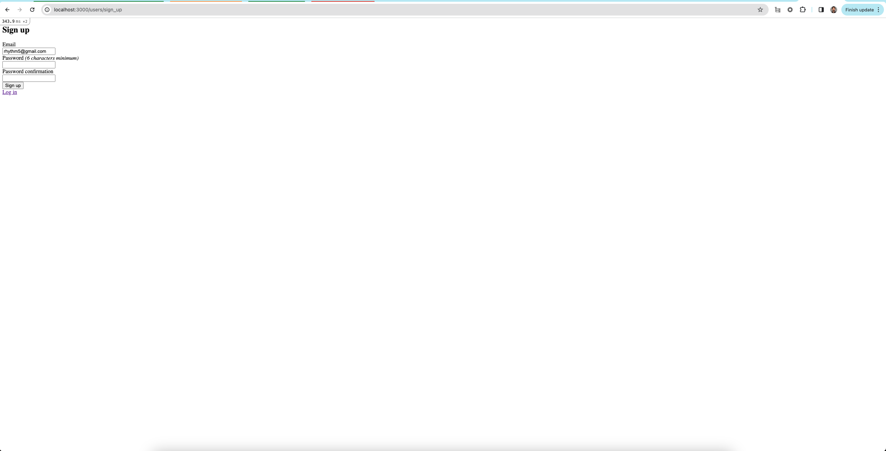
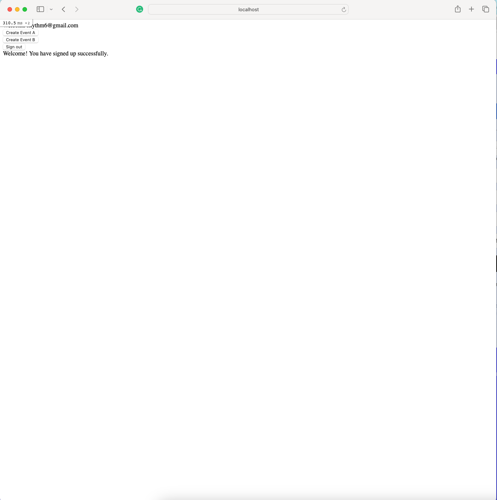
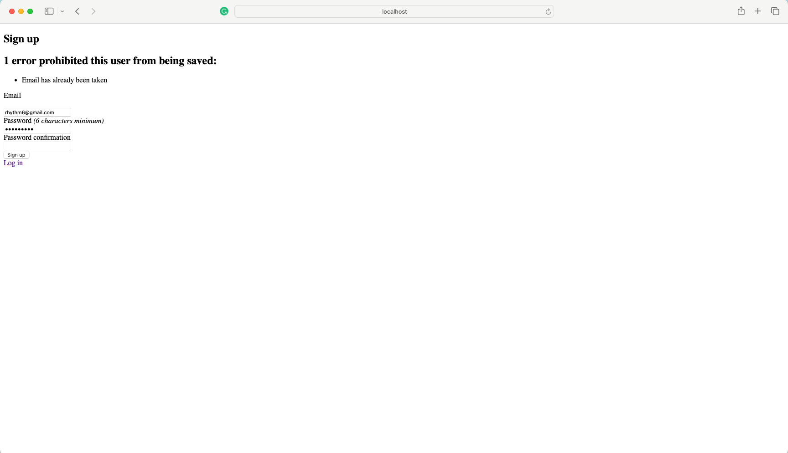

# README

1. Setting Up the Rails Application:
        Clone the Repository:

    Open a terminal.
    Navigate to the directory where you want to clone the repository.
        Run the following command to clone the repository:
    
        git clone <repository_url>

2. Install Dependencies:

    Navigate into the project directory:
        cd <project_directory>
    
    Run the following command to install the required gems:

        bundle install

3. Database Setup:

    Run the following commands to set up the database:

        rails db:create
        rails db:migrate

4. Running the Rails Application:
    Start the Server:

    Run the following command to start the Rails server:

    `rails server`

5. Access the Application:

    Open a web browser.

   Signup using the below link
   http://localhost:3000/users/sign_up
   
   
   You would be redirected to the create events page
   http://localhost:3000/events
   

6. Running Tests:
    Run RSpec Tests:

    Ensure that RSpec is installed (bundle install should have taken care of this).
    Run the following command to execute RSpec tests:
      
        bundle exe rspec

    Check the terminal for test results and any failures.

**********************

The main trade-off and decision is related to testing strategy:

**Trade-off**:

Testing with Mocks vs. Integration Testing: We chose to use WebMock to mock the API calls during testing. This allows us to test the service logic in isolation without relying on actual API interactions, which can be unreliable and slow down tests. However, this approach doesn't test the actual integration with the Iterable API and its potential quirks in real-world scenarios.

**Decision**:

We opted to prioritize testing the core logic of the service in isolation and avoiding external dependencies that could introduce instability during testing. This allows for faster and more reliable tests, which is crucial for rapid development and ensuring the service functions as expected. However, it's important to acknowledge that this doesn't replace the need for additional integration tests to ensure the service works seamlessly with the real Iterable API.

The decision to use mocks in this example prioritizes testing speed, isolation, and maintainability while acknowledging the need for a broader testing strategy in a real-world application.

************************
Screenshots:

